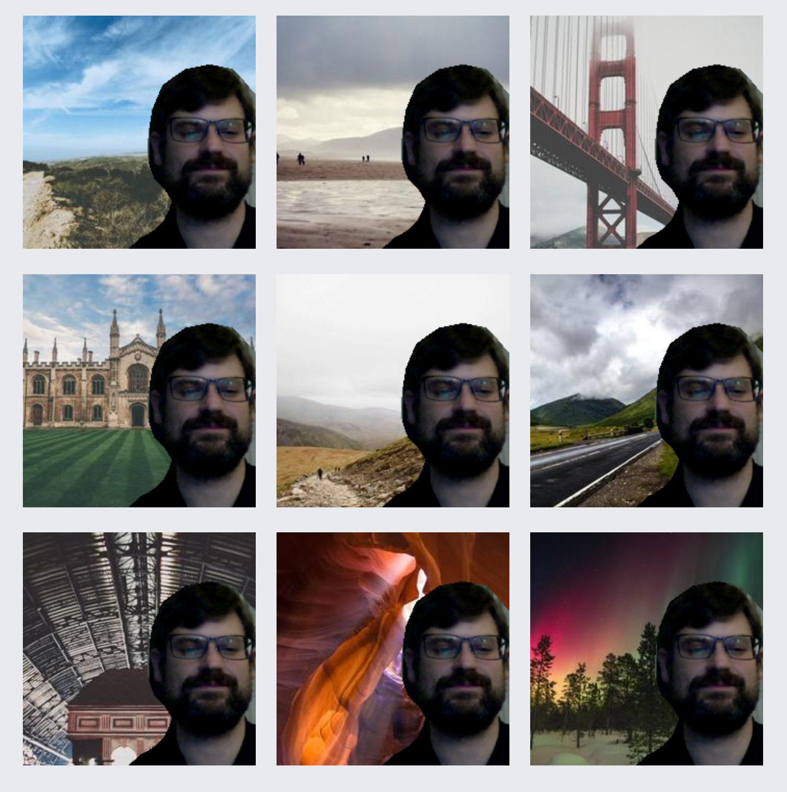

# webcam-greenscreen
playing with training sets and models from a webcam in Teachable Machine

things:
- find the person & swap background. how does the prediction change?
- does it improve generalization if used as augmentation (eg, inside/outside, other wall in the room)?

## screenshots
### what

### in all the places

